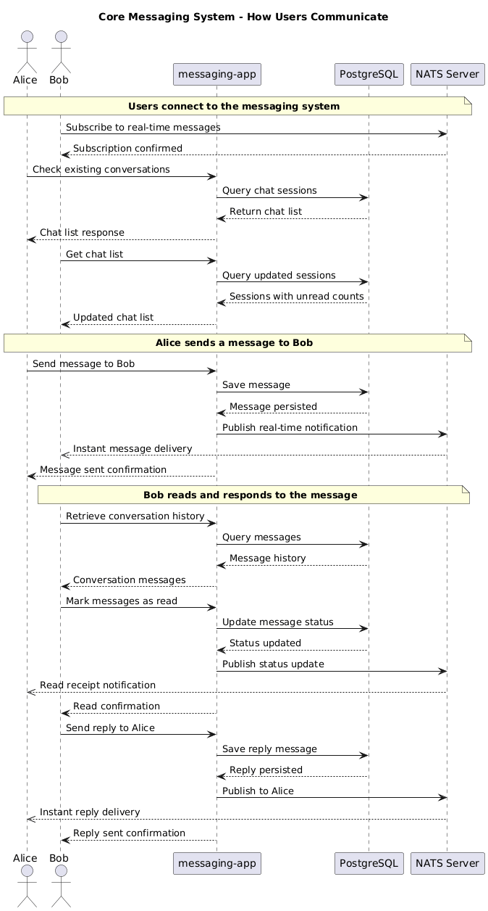

# Messaging Application

A stateless messaging application built with Go that supports horizontal scaling and real-time messaging.

## Table of Contents

- [Demo](#demo)
- [Getting Started](#getting-started)
- [Project Structure](#project-structure)
- [Architecture](#architecture)
- [Technology Decisions](#technology-decisions)
- [API Documentation](#api-documentation)
- [Testing](#testing)
- [Configuration](#configuration)
- [Design Assumptions](#design-assumptions)

## Demo

Watch the application in action! (click the image to go to youtube):

[](https://youtu.be/XvhCqJBBD2g)

https://youtu.be/XvhCqJBBD2g

## Getting Started

### Prerequisites

- Docker
- Docker Compose

### Quick Start

To start the project, run the following command from the root directory:

```sh
docker compose up
```

This will initialize the PostgreSQL database with migrations from `./migrations` and start a NATS-IO server with WebSocket support.

Then just build the service:

```sh
go build cmd/serve/main.go

./main
```

The service expects a [yaml configuration file](./config.yaml) in the same base path of the binary you are running.

To run the tests just run the following command:

```sh
go test ./...
```
### Service Configuration

**Database configuration:**

- Port: 5432
- Username/Password: postgres
- Database name: messaging_app

**NATS-IO configuration:**

- NATS protocol: Port 4222
- WebSocket: Port 8080

## Project Structure

```
messaging-app/
├── cmd/serve/               # Application entry point
├── internal/
│   ├── adapters/            # External integrations
│   │   ├── http/            # HTTP server and middleware
│   │   ├── nats/            # NATS message publisher
│   │   └── postgres/        # Database repository
│   ├── application/         # Application configuration and setup
│   ├── domain/              # Business logic and entities
│   ├── handlers/http/       # HTTP request handlers
│   ├── mocks/               # Generated mocks for testing
│   ├── ports/               # Interface definitions
│   └── testutils/           # Testing utilities
├── e2e/                     # End-to-end tests
│   └── testclient/          # Test client implementations
├── migrations/              # Database migrations
└── docker-compose.yml       # Development environment setup
```

## Architecture

The application follows hexagonal architecture principles to decouple business logic from technology-specific implementations. This approach introduces some indirection through interfaces, but allows the code to depend on behavior descriptions rather than specific databases or brokers.

Given the application's simplicity and minimal in-memory business logic, I reduced abstraction layers where possible. The implementation uses handlers that depend on repositories and other interfaces without implementing separate "drivers" and "driven" ports.

### Benefits of this approach

- Test handlers in isolation using unit tests
- Test each adapter independently
- Clear separation of concerns between modules
- Simple mental model for adding new technologies

### Communication Flow

The following sequence diagram illustrates how users interact with the messaging system:



The diagram shows the core messaging flow: users connect to both HTTP APIs and real-time NATS subscriptions, messages are persisted to PostgreSQL for reliability, and NATS provides instant delivery and read receipt notifications.

## Technology Decisions

### PostgreSQL

PostgreSQL serves as the persistence layer. However, this choice presents scaling challenges for unbounded collections like conversations and chats. Scaling PostgreSQL is not straightforward compared to databases designed with first support for sharding/partitioning.

For long-running applications, databases with better sharding support would be more suitable. Options include MongoDB, Cassandra, or serverless solutions like DynamoDB.

### NATS-IO

NATS-IO handles message pushing to users. It provides proven scalability, simple APIs and protocols, cross-region clustering capabilities, and solid WebSocket support.

NATS-IO also supports delegated authorization and authentication, allowing other servers to act as authorizers and set specific permissions for connections, including subject subscription limits and operation restrictions.

Alternative solutions include:

- Self-hosted RabbitMQ with web STOMP or web MQTT for WebSocket protocol translation
- Serverless options like EMQX or Firebase
- Custom in-house solutions

I selected NATS-IO based on familiarity and maintenance considerations.

## API Documentation

All HTTP APIs use middleware that extracts user information from configurable headers. The edge layer handles authentication and validation, populating these user model fields:

- userId
- email
- userHandler

### Endpoints

#### **GET /api/v1/chats**

Retrieves all existing chat sessions for the authenticated user.

**Response:**

```json
{
  "chats": [
    {
      "chat_id": "string",
      "participants": ["user1", "user2"],
      "last_message": "...",
      "updated_at": "2023-01-01T00:00:00Z"
    }
  ]
}
```

#### **GET /api/v1/chats/{chatId}/messages**

Retrieves messages for a specific chat with pagination support.

**Query Parameters:**

- `cursor` (optional): RFC3339 timestamp for pagination
- `limit` (optional): Number of messages to return (1-100, default: 50)

**Response:**

```json
{
  "messages": [
    {
      "sender_id": "string",
      "receiver_id": "string",
      "content": "string",
      "created_at": "2023-01-01T00:00:00Z",
      "status": "sent|read"
    }
  ],
  "next_cursor": "2023-01-01T00:00:00Z",
  "has_more": true
}
```

#### **POST /api/v1/chats/{receiverId}/messages**

Creates a new message in the chat session between the authenticated user and the specified receiver.

**Request Body:**

```json
{
  "content": "string" // required, max 10,000 characters
}
```

**Response:**

```json
{
  "sender_id": "string",
  "receiver_id": "string",
  "content": "string",
  "created_at": "2023-01-01T00:00:00Z",
  "status": "sent"
}
```

#### **PATCH /api/v1/messages/status**

Marks all messages up to and including the specified message as "read".

**Request Body:**

```json
{
  "message_id": {
    "sender_id": "string",
    "receiver_id": "string",
    "created_at": "2023-01-01T00:00:00Z"
  }
}
```

**Response:**

```json
{
  "updated_count": 5
}
```

### Error Responses

All endpoints return errors in this format:

```json
{
  "error": "Error message",
  "code": "ERROR_CODE",
  "details": "Additional details"
}
```

Common error codes:

- `NO_USER_CONTEXT` - Authentication required
- `VALIDATION_ERROR` - Request validation failed
- `ACCESS_DENIED` - Insufficient permissions
- `INVALID_JSON` - Malformed request body

## Testing

The code structure supports testing at multiple levels:

- Adapter layer testing against Docker images
- Handler testing using adapter mocks

For system-wide confidence, end-to-end tests bootstrap the complete application (server, database, NATS connection) and execute API requests with comprehensive assertions.

Two dedicated test clients handle API interactions and NATS message testing, providing centralized interaction points. These tests reproduce complete user journeys and verify expected outcomes, ensuring behavioral consistency during refactoring and development.

## Configuration

The application uses Viper for configuration management due to its reliability and flexibility.

## Design Assumptions

This application was built with these assumptions:

- Stateless design to support horizontal scaling
- State persistence handled by dedicated layers/technologies
- Real-time notifications through purpose-built technologies
- Cloud deployment using container runtimes (Kubernetes, Docker Swarm, ECS)
- TLS and authentication managed at the edge (API gateway, service mesh)
- CORS handling at the edge level (local testing configurations included for development)
